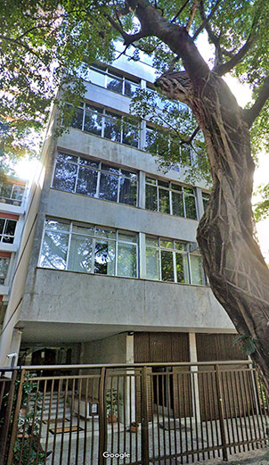

Then you ask me: what is Glenn and David's ENZULI anyway? It is nothing and it is everything at the same time in Verdevaldo's dirty business. Nothing because it is a scheme, a front company for Glenn Greenwald and his husband David Miranda to practice all sorts of illicit acts since its foundation.

Those who followed our Twitter yesterday saw once again the mini-saga of
_Better Call Glenn_ trying to buy airline tickets or hire some service related to what ENZULI claims to practice. First of all, I regret exposing the poor doorman because before checking my documents, he said more than he should have and gave more names than he could have.

When he contacted Glenn or his representatives, the doorman's posture changed and he started to get complicated. Anyway, I visited the places mentioned and although I obtained muy relevant information for the authorities to strongly investigate both Glenn and David - I hope that the boy will not be punished or retaliated against as it is unlikely that he knew what I wanted there.

## Nobody Visits ENZULI Trying to Buy Airline Tickets or Tour Packages

{: .align-left} It struck me how Greenwald maintains a network of contacts with suspicious and known criminals all over Rio de Janeiro and Região dos Lagos.. Things too important to be ignored about ENZULI and his former companies in that business that you all know he hates us bringing up.

The building where the IRS thinks ENZULI is, is actually part of Glenn Greenwald's headquarters. He lived there for years between 2007 and 2013. From there he operated his schemes that the blog has been raising and trying to help the police investigate what is said and found.

I'm not going to make past mistakes and raise the ball for him to cut. The people I talked to and got important information from yesterday need now to have the courage, when called to testify as witnesses, not to give up.

I am very grateful to readers of the blog who know Glenn and ask me to be more cautious in 'running after him' and investigating his business dealings. But it is either this, or we will be held hostage by him and his entire apparatus of friends like Gilmar Mendes: the one who wants to empty the jails to contain the PCC.

All the focus now is on the whistle-blowing of Luiz Molição, but the trail of Glenn's dirty money goes through ENZULI. Let's investigate, right authorities? It's time to open Pandora's Box.