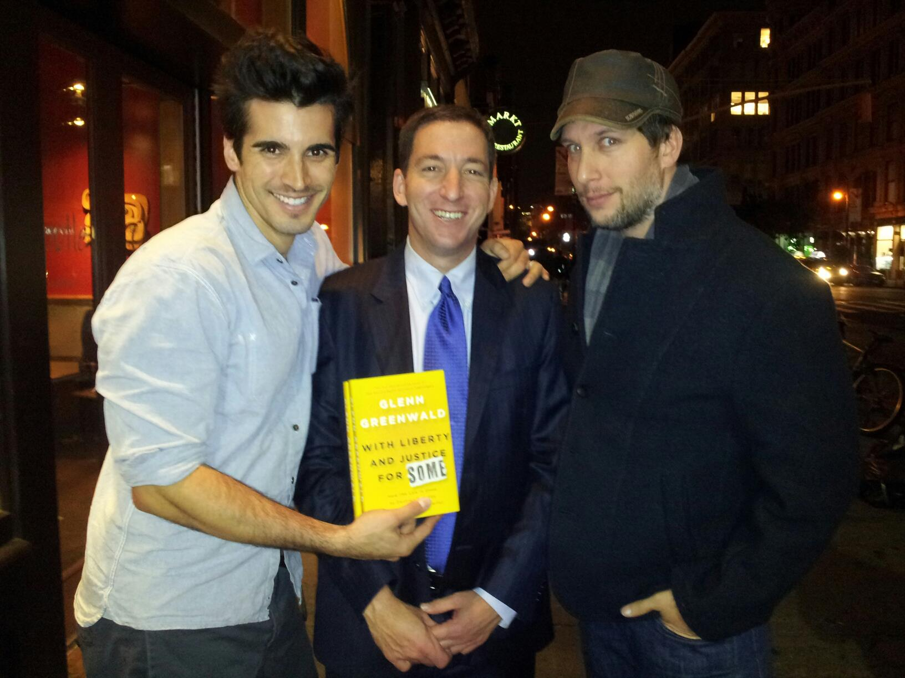

# Wallowing Partners

[{: .align-right .jason}](assets/images/wallow.jpg)  
Jason Buchtel was Glenn's business partner from around 2002 to at least 2010.
The "we" mentioned in pages like this
refers to Glenn and Jason.
{: .notice--primary}

# In his own words

## I am Jake Jaxson

{: .align-left .jason} When [NY Daily News linked Glenn and Jason](https://www.nydailynews.com/news/national/greenwald-reporter-broke-nsa-story-lawyer-sued-porn-biz-article-1.1383448) through court documents in June 2013,  
Jason published the biographical article
[I am Jake Jaxson.](IamJJ.md){: .btn .btn--info}  

He explains Master Notions was "cofounded with Glenn", where 
they "really enjoyed being able to work in a strategic space that had no boundaries".  
He was involved in "helping to launch, market, and manage his original blog Unclaimed Territory".  
That's a little strange for a short-term business partner Glenn left behind in NYC a year earlier.
{: .notice}

## About "Us"

Glenn gets a big mention in the second sentence of the
[About Us](https://cockyboys.com/pages.php?id=meet-the-morecocks) page on Cockyboys.com.

{: .align-left  .jason}
We've reproduced [the superior 2015 version.](morecocks/web.archive.org/web/20151128034652if_/https:/cockyboys.com/pages-meet-the-morecocks.html){: .btn .btn--primary}
The page just isn't the same without   
**Benny** "I do porn things, but I also do so much more" **Morecock**  
{: .notice--warning }  

 
{: .cl}

Awards
=========

[{: .align-right .jason}](assets/images/sketchy2.jpg)

Glenn and Jason appear to have stopped working closely together around 2010--11.  
Jason and his husband Adrian (aka RJ) are pictured here in late 2011 with Glenn and David. 

Shortly after that, Jason started winning awards.


The elegance and professionalism of the ceremonies seemed to remain fairly consistent,
although the stages grow ever larger.
{: .notice--danger}

<!--   -->
