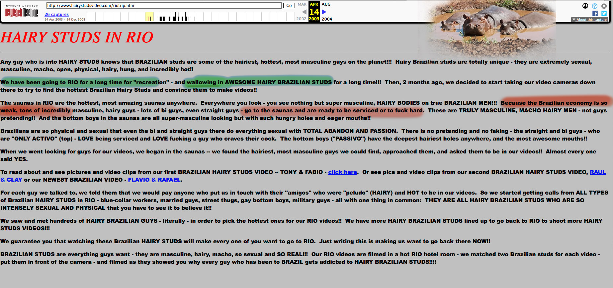
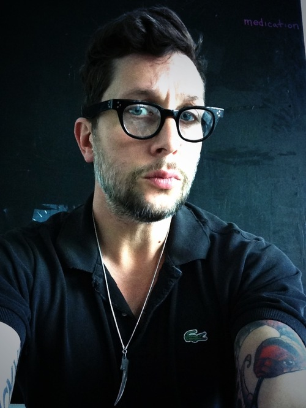

# Wallowing Partners

[{: .align-right .jason}](assets/images/wallow.jpg)  
Jason Buchtel was Glenn's business partner from around 2002 to at least 2010.
The "we" mentioned in pages like this
refers to Glenn and Jason.
{: .notice--primary}

# In his own words

## I am Jake Jaxson

{: .align-left .jason} When [NY Daily News linked Glenn and Jason](https://www.nydailynews.com/news/national/greenwald-reporter-broke-nsa-story-lawyer-sued-porn-biz-article-1.1383448) through court documents in June 2013,  
Jason published the biographical article
[I am Jake Jaxson.](IamJJ.md){: .btn .btn--info}  

He explains Master Notions was "cofounded with Glenn", where 
they "really enjoyed being able to work in a strategic space that had no boundaries".  
He was involved in "helping to launch, market, and manage his original blog Unclaimed Territory".  
That's a little strange for a short-term business partner Glenn left behind in NYC a year earlier.
{: .notice}

## About "Us"

Glenn gets a big mention in the second sentence of the
[About Us](https://cockyboys.com/pages.php?id=meet-the-morecocks) page on Cockyboys.com.

{: .align-left  .jason}
We've reproduced [the superior 2015 version.](morecocks/web.archive.org/web/20151128034652if_/https:/cockyboys.com/pages-meet-the-morecocks.html){: .btn .btn--primary}
The page just isn't the same without   
**Benny** "I do porn things, but I also do so much more" **Morecock**  
{: .notice--warning }  

 
{: .cl}

Awards
=========

Glenn and Jason appear to have stopped working closely together around 2010.  
Shortly after that, Jason started winning awards

## In 2013, his movie _Project Gogo Boy_ won four awards at the Grabbys, including Best Director.

This clip of the awards ceremony showcases the professionalism for which the industry is famous.



## In 2017 He won Best Director at the Str8UpGayPorn Awards.

Rachel Maddow is the first person he mentions in his acceptance speech.  
Glenn has been forgotten again. 


## And Best Director at the Grabbys in 2017 also

Just in case that last awards ceremony wasn't classy enough, this one has a bigger stage.



## In 2019 he won Best ScreenPlay at the Grabbys



## Gay VN 2020 Best Director
This took place in January, in case you're wondering why they're not all six feet apart.




