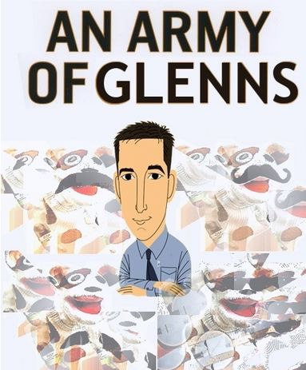

# The Anti-Fandom of Glenn Greenwald.

Glenn has an extraordinarily devoted antifan following.  

As far back as 2006, they were creating pages and entire sites to catelog his lies.

## All Things Glenn

- ``Jan 31, 2016`` Dave Emory on Spitfire List: [Compendium on Citizen Greenwald: A Shiller for Killers](http://spitfirelist.com/for-the-record/ftr-888-compendium-on-citizen-greenwald-a-shiller-for-killers/)
     - ``November 22, 2013`` also: [Citizen Greenwald's Problem With the Truth.](https://spitfirelist.com/news/citizen-greenwalds-problem-with-the-truth/)
- ``Jun 27, 2013`` The Other McCain: [Glenn Greenwald Is a Ridiculous Joke](https://theothermccain.com/2013/06/27/glenn-greenwald-is-a-ridiculous-joke-and-alas-the-internet-never-forgets/)
- ``Mar 11, 2014`` John Young on Cryptome: [Glenn Greenwald Eyeball](https://cryptome.org/2014-info/glenn-greenwald/glenn-greenwald.htm)
- ``January 19 2014`` Sean Wilentz in New Republic: [Would You Feel Differently About Snowden, Greenwald, and Assange If You Knew What They Really Thought?](https://newrepublic.com/article/116253/edward-snowden-glenn-greenwald-julian-assange-what-they-believe)
- ``May 13 2013`` Jacobinism Blog: [Drooling Self-Love & Dime-Store Third Worldism: The Rage, Relativism & Racism of Glenn Greenwald](http://jacobinism.blogspot.com/2013/05/drooling-self-love-dime-store-third.html)
- ``May 2013`` Discussion related to preceding article.[defend the indefensible: glenn fucking greenwald](https://www.ilxor.com/ILX/ThreadSelectedControllerServlet?action=showall&boardid=40&threadid=96478)

## Porn and Master Notions

- ``June 16, 2020`` Oswaldo Eustáquio (Portuguese) [Glenn Greenwald humiliated Jews in Nazi porn productions in the US](https://emribeirao.com/policial/glenn-greenwald-humilhava-judeus-em-producoes-pornograficas-nazistas-nos-eua-37125)  
Apparently based in part on an interview with someone now in Argentina, we cannot verify all the details. But like the Better Call Glenn pages, key details do fit documentary evidence.  
Amongst other allegations, it says:  
> Dressed as Darth Vader, Glenn Greenwald performed his sexual fantasies with young men without much hair on their bodies, who were called by the American “My Anaquim”.

## Sock Puppetry

{: .align-right .jason}
- ``Jul 27, 2006`` Patterico on Blog: [Annotated WuzzaDem: The Facts Behind the Greenwald Sock-Puppetry](http://patterico.com/2006/07/27/annotated-wuzzadem-the-facts-behind-the-greenwald-sock-puppetry/)
- ``Aug 26, 2012`` Adam Levick for Camera UK: [Background on Greenwald for Guardian Readers: 'Sock Pupppets' & 'Smart Spam'](https://camera-uk.org/2012/08/26/background-on-glenn-greenwald-for-guardian-readers-sock-puppets-smart-spam/)
- ``July 20, 2006`` [Glenn Greenwald’s IP Address Stolen](https://www.outsidethebeltway.com/glenn_greenwalds_ip_address_stolen/)

## On Anti-Semitism and Defending Nazis

- ``May 27, 2008`` Socialism of Fools Blog [Illegal Wiretapping Indeed](http://www.socialismfools.com/2008/05/illegal-wiretapping-indeed.html)
- ``Jul 25, 2012`` Adam Levick for The Times of Israel: [The Guardian and Glenn Greenwald: The anti-imperialism of fools](https://blogs.timesofisrael.com/the-guardian-and-glenn-greenwald-the-anti-imperialism-of-fools/)
- ``Jul 11, 2013`` Adam Levick for The Algemeiner: [Glenn Greenwald's Anti-Semitism Exposed](https://www.algemeiner.com/2013/07/11/glenn-greenwalds-anti-semitism-exposed/)
- ``May 20, 2019`` David Niewert for the Daily Kos: [Glenn Greenwald's strange far-right blind spot](https://www.dailykos.com/stories/2019/5/20/1859118/-The-Tale-of-the-Pontifex-Maximus-and-His-Lawyer-Glenn-Greenwald-s-strange-far-right-blind-spot)
- ``Mar 12 2004`` Greenwald is a Dolt chasing 15 Minutes of Fame: [Trial by Media](https://archive.org/details/TrialByMediaByEdgarJ.Steele2004-OnMattHalesTrial)
- 2013 [Context of 'January 9, 2003: White Supremacist Church Leader Arrested for Soliciting Murder of a Judge'](https://web.archive.org/web/20130214223104/http://www.historycommons.org/context.jsp?item=a0103halearrest)
- ``January 26 2001`` Glenn was the subject of a _Nazi Alert_. [Jewish Attorney Represents Jew-hater](https://web.archive.org/web/20020701035631/http://www.jdl.org/enemies/nazi/greenwald.shtml)
- ``October 9, 2014`` Daily Banter report on Weev's release from jail . [iPad Hacker Released From Jail, Parties with Glenn Greenwald, Publishes Neo-Nazi Screeds](https://thedailybanter.com/2014/10/09/ipad-hacker-released-jail-parties-glenn-greenwald-publishes-neo-nazi-screeds/)

## The Intercept

{: .align-right}
- ``November 27, 2013`` Pando Daily by Mark Ames: [Keeping Secrets: Pierre Omidyar, Glenn Greenwald and the privatization of Snowden's leaks](https://pando.com/2013/11/27/keeping-secrets/)
- ``February 27, 2015`` Ken Silverstein for Politico: [Where Journalism Goes to Die](https://www.politico.com/magazine/story/2015/02/ken-silverstein-the-intercept-115586/)
- ``December 15, 2014``   Was Taibbi's firing related to comments about Glenn?: [They can tell you’re an enormous asshole](https://www.wired.com/2014/12/life-and-death-of-the-racket/)
- ``February 3, 2016`` Pando Daily by Mark Ames: [All the billionaire's men (Or: Shattered Glenn)](https://pando.com/2016/02/03/all-billionaires-men-or-shattered-glenn/)
- ``March 15, 2019`` Columbia Journalism Review [The Intercept Cuts Back](https://www.cjr.org/business_of_news/layoffs-the-intercept.php)
- ``December 11, 2013`` JP Sottile in Shadow-Proof: [Greenwald's Twitter War over PayPal-NSA Allegations](https://shadowproof.com/2013/12/11/twitter-hosts-epic-war-of-words-over-paypal-nsa-allegations/)

## Miscellaneous 

- ``August 2021`` Eric Levitz in NY Magazine: [Glenn Greenwald Speaks Truth to Reply Guys](https://nymag.com/intelligencer/2021/08/glenn-greenwald-speaks-truth-to-reply-guys.html)

### Politics

 - ``April 20, 2011`` Dana Houle, Rooted Cosmopolitan [Glenn Greenwald: Neither a Liberal Nor a Progressive](https://rootedcosmopolitan.wordpress.com/2011/04/20/glenn-greenwald-neither-a-liberal-nor-a-progressive/)
- ``May 3 2019`` Novak Archive [Why Does Glenn Greenwald Keep Appearing on Tucker Carlson's Show?](https://www.novakarchive.com/foias/2019/4/20/why-does-glenn-greenwald-keep-going-on-tucker-carlsons-show)

### Glenn's Defense of Proud Boys
- ``21 August 2019`` Ari Paul on Souciant [The Greenwald Denial](http://souciant.com/2019/08/the-greenwald-denial/)

### Wikipedia 
<aside>Glenn's Wikipedia page resembles a war zone, heavily censored by its subject.</aside>
The highlight of [this July 2006 version](https://en.wikipedia.org/w/index.php?title=Glenn_Greenwald&oldid=66453842){: .btn .btn--info} is a definition:
> __glenn of sock puppets__: multiple sock-puppets driving home exactly the same points, usually
> starting with a recitation of the puppet-master’s resume.

 

_Better not forget_:
## David Miranda

- ``August 5, 2019`` [David's talentspotting role described](https://www.agoraparana.com.br/politica/deputado-david-miranda-era-garoto-de-programa-e-vendia-drogas-em-boate-gay-no-rio-de-janeiro/)
- ``August 30 2013`` The Jawa Report blog [Court Grants UK Police Right to View Snowden Files, Glenn Greenwald's Gay Porn Collection](https://web.archive.org/web/20131113034015/http://mypetjawa.mu.nu/archives/216819.php)

# Glenn in the replies

A number of web pages are something of the opposite: not about Glenn at all, but noteworthy for the references to Glenn in the replies.

``July 23, 2020`` Replying to Ezra Klein: _Wow, there are more sockpuppets here than a Glenn Greenwald slumber party._ [When Tucker Carlson asked to join Journolist](http://voices.washingtonpost.com/ezra-klein/2010/07/when_tucker_carlson_asked_to_j.html)