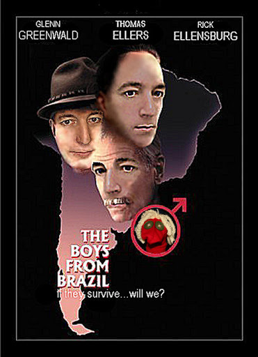

# Intro

_This site is incomplete and under active development in June 2021_. 
For those in search of further details and evidence, here are some starting points wtih [threads about Glenn on Twitter](TwitterThreads.md){: .btn .btn--success}. 

# Glenn's Blue Period

Glenn has admitted to co-ownwership of Hairy Studs Video and Studmall
but has stated in numerous profiles and interviews 
that his involvement in the porn industry ended in 2004, 2-3 years after it started.
[Key Excerpts and links](/interviews/){: .btn .btn--danger}

## US-Published Articles about Greenwald's porn empire


[Alternative Link to NY Daily News article](https://www.pressreader.com/usa/new-york-daily-news/20130627/281616712946068)

## But is Glenn's claim true?
If it is, then Glenn's Blue Period would be exactly 100 years after Picasso's.  
{: .notice--warning}
Had _New York Daily News_, _Buzzfeed_, _The Guardian_ and others not been too shy to check, they might have quickly realized there is overwhelming evidence against Glenn's version of events.

### Documentary evidence

DNS and corporate records, and other key documents --- including video box covers themselves --- are being gradually added to this site.  
View the domain name record history for Studmall and Hairy Studs Videos
[here.](/DNS/){: .btn .btn--danger}  
The impatient will find most of them [already on Twitter.](TwitterThreads.md)

#### David Miranda - Director and Custodian of Records
*R or X-rated links*{: .notice--warning}

{: .align-right .modcard}
David Miranda's porn director career took off at exactly the same time as Glenn moved to Brazil.  
[One major porn catalog lists him as director for eight movies](https://gay.aebn.com/gay/directors/19979/david-miranda)  
The [Gay Erotic Video Index Studmall listing](https://www.gayeroticvideoindex.com/C/7/6277.html) has some interesting surprises.    
Especially the box covers.
{: .notice--success}

> This can get a little complicated. Branding is not consistent, catalogs are not perfectly accurate, and
> [{: .align-right}](assets/images/1528420bh.jpg)
> multiple box covers can exist for the same movie. Here's a genuine box cover for Tattooed Tops
> although you won't find it in the list I just mentioned. **David Miranda, 2010**.
{: .align-left}

 
{: .cl}

## Brazilian Reporting

[{: .align-right .jason}](/assets/images/DMstand.jpg)
Articles in the Brazilian press in August 2019, first alleged that said Glenn had produced porn in Brazil, with David, and for a considerable while.  
They were based on interviews and did not seem to have any actual post-2004 records or movie titles. We do not know with whom and we cannot verify all the details.
Yet some of the facts they stated about dates, locations  and people involved --- not previously published --- we can verify by other means. None of these articles is a hit piece that someone casually made up.  
David's role as talent scout for movies Glenn produced was described in 
[Era Garoto de Programa](/DavidTalentScout.html){: .btn .btn--warning} **NEW**{: .new}
{: .notice--danger}

### BetterCallGlenn

A Brazilian site devoted to this subject, BetterCallGlenn.com, was created in 2019.
The site is no longer active but most of the articles are preserved on the Internet Archive.  

We have included a number of translations as well as links to the originals, which can be accessed from the sidebar those pages.  
Start with [A sexual predator named Glenn Greenwald, Part 1](predator-part-1.md)

## HX articles: Glenn's porn tips

 was the leading gay listings magazine in New York City for most of the 90s and 00s.
{: .notice--success}

In February 2005, the very same week that Glenn and David "met on the beach" in Rio, back in NYC, HX published an article **Cheap Trixxx** under the by-line of an unknown writer and "resting" lawyer, Glenn Greenwald.  
How did you ever manage without its handy advice?
> DON'T forget about the sound. If you're shooting in New York, close your windows!  
> Nothing is worse than the sound of hot sex being drowned out by sirens, passing buses and couples fighting next door.

_UPDATED_{: .new .align-right}
The article was simultaneously promoted on the Studmall.com website.
[Read it here.](/hxpromo/){: .btn .btn--large .btn--danger}

A couple of years earlier, HX published [Razor Burned.](Sullivan.md){: .btn .btn--primary}  promoting Hairy Studs Video, by Andrew Sullivan.  
How did Glenn get Andrew Sullivan, who was much more famous than Glenn at the time, to write this promotional piece for his porn company?
{: .notice--success}

## The Canadian Government Position 

Paul Calandra, likely informed by Canadian Intelligence, described him as a **Porn Spy**.



Previously he had described Glenn as a
[former porn industry executive](https://www.youtube.com/watch?v=JNQ_aVaMMw4&t=23s){: .btn .btn--warning}  
These statements, made in late 2013, suggested a much greater involvement in the industry than Glenn had admitted to New York Daily News. But they did not give details.

## Nearly Eight Years
> One person we can check with is Jake Jaxson, his former business partner.
> He doesn't say anything about two years.
> And the documents support Jason.



### Jason Sketchy pages
Jake Jaxson's real name is Jason Buchtel, 
but we just call him [Jason Sketchy](Jason.md).

## Glenn's forgotten websites

We host our own reconstructions of some of Glenn's lost websites. I don't expect he will be grateful for their rediscovery.

These are constructed almost entirely based on material from the [Wayback Machine](https://archive.org) but with faster and more reliable navigation, and fewer dead links.

### RioGayGuides and RioMaleEscorts 
_A reconstruction of sites Glenn and David set up in Brazil in 2005_.



## Other Sites About Glenn

{: .align-left .jason} Glenn has inspired a remarkable number of web pages - even entire sites - specifically about him. Few are praiseworthy. Some of the earliest were about Glenn's famous sock-puppets, in 2006. Others cover material from Edward Snowden, to porn production, to his whole history of lies.  
_UPDATED_{: .new} See our collection of [pages by Glenn's Antifans.](SitesAboutGlenn.md){: .btn .btn--danger}
{: .notice--success} 

 {: .cl}

### What's Glenn's Best Movie?

We're not really a movie review site.  
More of a _This Movie Really Exists and Glenn Really Produced It?_ site.

But since you asked, we're currently fond of this. 
<video controls width="720">
<source src="/assets/video/GreenCat.mp4" type="video/mp4">
</video>

# Other Lies

## Legal Career: Matthew Hale

Glenn condemned the denial of law license to a leading American Neo-Nazi as 
an "egregious constiutional abuse" in [this court filing.](/cases/HaleEgregious.md). Although he claims now to have been a "First Amendment" lawyer, his failed attempt to claim a constitutional right to a law license may have been his only such case.

_NEW_{: .new}  We have collected some details of his cases, including two [representing HX Magazine.](/cases/Theissen.html){: .btn .btn--info}
{: .notice--primary}

## Awards

The subject Glenn lies about the most is himself.
In his telling, he [graduated top of his class](/Lies.html) and even
thinks he has a [Pulitzer Prize](pulitzer.md){: .btn .btn--warning .btn--large}

## Glenn's earliest ventures

The Sun Sentinel in 1985 [reported](SunSentinel.md) on Glenn's attempts to win his grandfather's old council seat.  
That's the _self-taught, deprived childhood_ myth, shattered.

 

# Keira Knightley Guest Appearance

The only specific link this has with Glenn is that it's very creepy. 
But we need somewhere to put a video that Google appear to be trying very hard to hide.

[Weinstein-Zuckerberg party for one](Yuri.md){: .btn .btn--danger .btn--large} 

# Under Development

## Brands and Legal Entities

- Law Office: [link](https://www.bizexposed.com/New_York-USA/B/Law_Office_of_Glenn_Green_Wald-New_York.php)
- Master Notions: [link](https://twitter.com/AlanVRK/status/1299119861809975297) [link](https://twitter.com/AlanVRK/status/1298995252284362752)
- StudMall : [link](https://twitter.com/AlanVRK/status/1298396468844396545) [link](https://twitter.com/wokyleeks/status/1299021151352393728) [link](http://web.archive.org/web/20050208081923/http://www.studmall.com/contact.php)
- Hairy Studs Video: [link](https://twitter.com/AlanVRK/status/1299762747266215937)
- Enzuli Productions: [link](https://twitter.com/AlanVRK/status/1299776571482476548) [link](https://twitter.com/AlanVRK/status/1299788774382211072)
- Ravana LLC: [link](https://twitter.com/AlanVRK/status/1298626981848899585) [link](https://twitter.com/AlanVRK/status/1298717258919813122) [link](https://twitter.com/AlanVRK/status/1299080322919862272) [link](https://twitter.com/AlanVRK/status/1299081614513840128)
- Bareback Inc: [link](https://twitter.com/AlanVRK/status/1298734275601281025)

## Documents

- ``Aug 23, 2001`` US District Court for the Northern District of Illinois: [Anderson v. Hale, 159 F. Supp. 2d 1116 (N.D. Ill. 2001)](https://law.justia.com/cases/federal/district-courts/FSupp2/159/1116/2384296)
- ``Feb 02, 2003`` Committee Report for New York City Bar: [Formal Opinion 2003-02: Undisclosed Taping of Conversations by Lawyers](https://www.nycbar.org/member-and-career-services/committees/reports-listing/reports/detail/formal-opinion-2003-02-undisclosed-taping-of-conversations-by-lawyers-1)
- ``Feb 01, 2017`` Jewish Defense Organization: [Dossier on Glenn Greenwald](./docs/jewish-defense-organization-dossier.pdf) [1]
- ``Apr 14, 2020`` ProPublica: [RAVANA LLC - Coronavirus Bailouts](https://projects.propublica.org/coronavirus/bailouts/loans/ravana-llc-a962e2a231387214e7a1c7778ec6e3ab)

## Miscellaneous Published Articles

- [Articles](articles.md)

[1]: http://docshare.tips/the-story-of-a-jew-who-fell-in-love-with-a-nazi-the-glenn-greenwald-matt-hale-affair_58aa1654b6d87f6f5d8b5237.html
[2]: https://www.gayeroticvideoindex.com/C/7/6277.html
[3]: https://www.gayeroticvideoindex.com/D/3/2013.html
[4]: https://gay.aebn.com/gay/studios/19516/hairy-studs-video
[Z1]: https://www.fbi.gov/wanted/cyber/evgeniy-mikhailovich-bogachev
[Z2]: https://aficwomendirect.org/director/jenkleiner/

